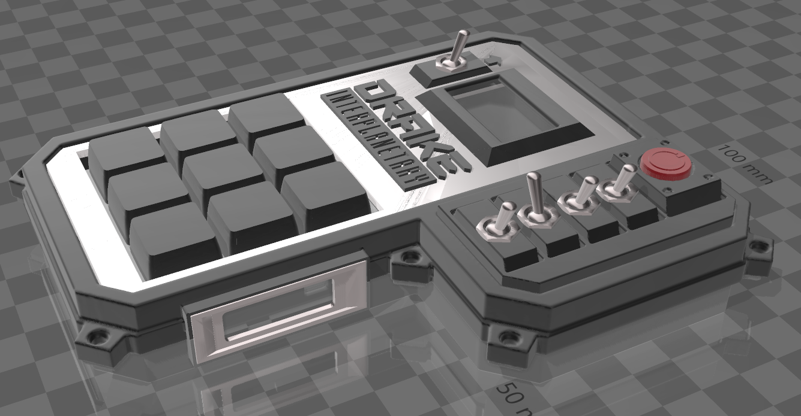

# DRAKE
## Drake button box 2.0
See the original button box at: https://github.com/mccawley74/DRAKE

### 3D Model of the finished box


### Printed and assembled box


This is the code for the windows HID button box in the style of Star Citizen DRAKE design.
The original design was by HANNAHB888 you can find her original artwork for this box as well as other work she's done at https://www.reddit.com/r/starcitizen/comments/hph00n/drake_interplanetary_smartkey_thing_that_i_made/

This box is the second design based off of her original artwork, and turned into a functional model, and code.
You can find the 3D printable files over at Cults: https://www.reddit.com/r/starcitizen/comments/xkcxmy/version_2_of_my_button_box/

The box uses an Arduino pro micro, and while there is no wiring schematic, the following should be quite straight forward.
All pins are labled as to what they connect to. All buttons and switches are GPIO to ground.

Switch one is a three way switch and connects to pins 19 and 1
The remaining three switches connect to pins 15, 14, 16, and the other end of the switch connects to ground.
Arduino pin 10 drives Vcc for the keyswitch L.E.D's if you want to run backlit keys.
Arduino pin 18, is a button to ground that changes brightness. The value is written to EEPROM so it remains after USB disconnection.

Pins 2, and 3 drive the OLED screens.
Pins 4, 5, 6, 7, 8, 9, All drive the button matrix. See the links below for setting up a 

button matrix.
1. https://haneefputtur.com/making-matrix-keypad-with-push-buttons-arduino.html
2. https://github-wiki-see.page/m/SHWotever/SimHub/wiki/Arduino---Button-matrix

I'm sure there are more sites with info out there. A bit of reading and it's quite understandable

## Arduino Pro Micro wiring diagram
```
                         +-----+
                +--------| USB |-------+
                |        +-----+       |
   Switch Five  | [1] TX         [RAW] |
                | [0] RX         [GND] |  Ground
        Ground  | [GND]          [RST] |
        Ground  | [GND]          [VCC] |  Voltage for OLED
      OLED SDA  | [2] SDA      A3 [21] |  Small Button
      OLED SCL  | [3] SCL      A2 [20] |  Large Button
  Keypad Row 1  | [4] A6       A1 [19] |  Switch One
  Keypad Row 2  | [5]          A0 [18] |  L.E.D. Control input
  Keypad Row 3  | [6] A7     SCLK [15] |  Switch Four
  Keypad Col 1  | [7]        MISO [14] |  Switch Three
  Keypad Col 2  | [8] A8     MOSI [16] |  Switch Two
  Keypad Col 3  | [9] A9      A10 [10] |  L.E.D. PWM Vcc Out
                |                      |
                +----------------------+
```
## Keyboard Emulation
The box operates as a Windowd Keyboard. Showing up in Windows as a simple keyboard

There are 9 buttons on the matrix keypad. with switch one having three profile settings.
this equates to 27 keys in total. The Nine keypad buttons are all momentary, with press, and hold functionality.

The three switches, whitch when crossing from (off to on), or (on to off) will register as a single key press.

## OLED Screen/Screens
The two screens show the same information as of this writing.
The plan was to have two seperate screens, showing different ionformation, however the screens I had in my drawer are not I2C addressible. So both OLED screens are on 0x3C.

Feel free to mofify for two screens. Though memory is sparce as is.

**NOTE:** You could also remove the side screen, and just run the faceplate screen as well.

1. Switch One and Switch Five is each half of a 2-way switch, center to ground
2. All switches are connected from the arduino GPIO to ground with Internal pullups.
3. L.E.D key backlighting uses one 330ohm resistor per three L.E.Ds
4. This version of code uses two OLED screens. One side mounted 128x32
   And onea top mounted 128x64. However they are both set to 128x64 and on
   the same I2C address 0x3C [duplicated screens]
   The plan was to have seperate screens, but the OLEDs I have are not I2C
   address modifyable, plus it came out looking just fine afer some formatting.

## Mapping keys to Star Citizen
The key mapping is done by editing the file menumap.h there is a struct for each of the buttons, switch groups, and keypad profiles.

### Default mapping
The default mapping is three profiles. Switch one position:
1. Default, which maps the keypad to common used controls. See defaultMenu
2. Maps the keypad to the Power Triangle. See powerMenu
3. Maps the keypad to shields. See shieldMenu

Example code from memumap.h This maps the three switches 2, 3, 4
You can see that the struct holds the name to display on the OLED, and the keyboard key to press. E.g. Toggling switch 2 will shoe "LIGHTS" on the OLED, and press keyboard key "l"

```
const OLEDMENU switchMenu[4] PROGMEM = {
  {"LIGHTS", 'l'},
  {"VTOL", 'k'},
  {"GEAR", 'n'},
  {"* EJECT *", 'l'},
};
```
<em>Feel free to edit and modify the structures to suit your specific mapping in Star Citizen </em>

### That's about it. Have fun and feel free to change up the code as you see fit. Have fun.
